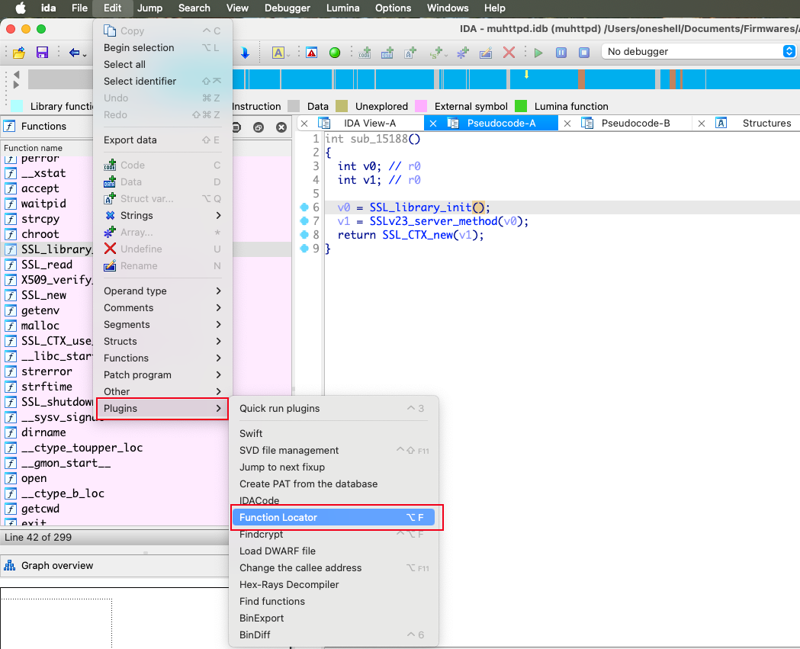
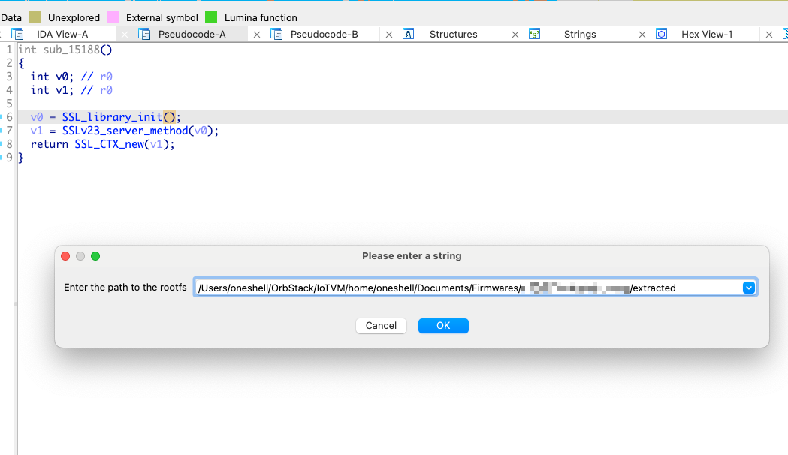
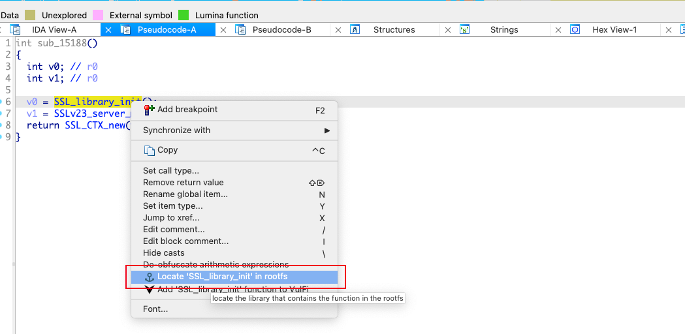
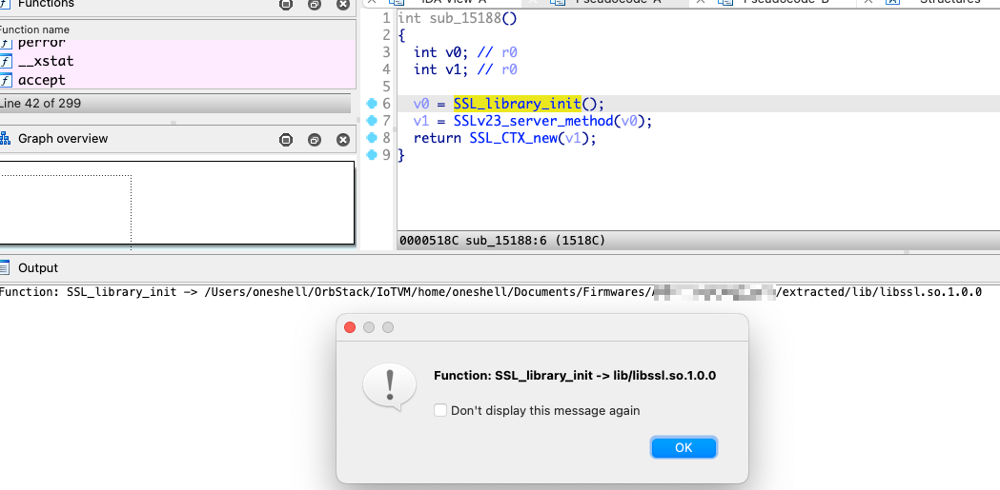

# Function Locator
This is a plugin designed to help IoT security researchers locate which dynamic library a target function belongs to within a root filesystem (rootfs).

# Usage
1. Click **Edit -> Plugins -> Function Locator** to trigger the plugin.
   
2. In the pop-up window, enter the absolute path of the rootfs. The plugin will be initialized at this point.
   
3. In IDA's decompilation or disassembly window, right-click, and then click **Locate function in rootfs** from the pop-up menu.
   
4. The results will be displayed both in a pop-up window showing the path of the dynamic library relative to the rootfs, and in the command window displaying the absolute path of the dynamic library.
   

# Install
This plugin uses `pyelftools` to parse dynamic libraries (I also tried using IDAPython's own APIs, but they were not very convenient). Use the Python 3 version that your IDA uses to install it:

```
python3 -m pip install pyelftools
```

then move `function_locator.py` into your IDA plugins directory

## Contribution
If you encounter any issues, have suggestions for improvements, or want to add new features, please submit an issue or a pull request.
If you have any other questions, please feel free to ask.